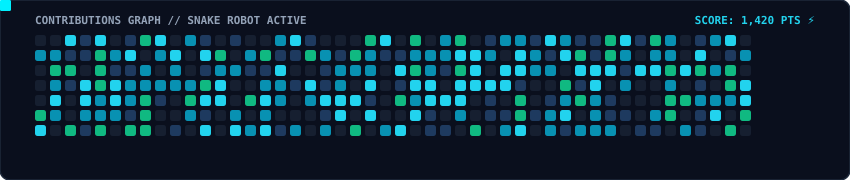

<div align="center">

  <!-- 🚀 MAIN BANNER -->
  

  <br/><br/>

  [;%F0%9F%93%90+3D+Robotics+CAD+Designer+(Fusion+360);%F0%9F%93%A1+IoT+%26+Hardware-Software+Architect;%F0%9F%92%A1+Turning+Silicon+%26+Code+into+Intelligent+Machines)](https://github.com/RUPESHKUMAR559)

  <!-- 🌐 SOCIAL COMMAND CENTER -->
  <a href="https://www.linkedin.com/in/rupesh-kumar-2b116b428/" target="_blank">
    
  </a>
  &nbsp;
  <a href="https://www.instagram.com/its_rupesh_k143/" target="_blank">
    
  </a>
  &nbsp;
  <a href="mailto:rupesh2512103@ctiemt.ctgroup.in">
    
  </a>
  &nbsp;
  <a href="https://github.com/RUPESHKUMAR559?tab=repositories">
    
  </a>
  &nbsp;
  

</div>

<br/>

---

### 🖥️ Robotics Workstation Terminal

<div align="dark.svg">
  
</div>

<br/>

---

### 🛰️ System Architecture & Mission Specs

```yaml
Operator       : Rupesh Kumar
Codename       : Cyber-Roboticist
Discipline     : B.Tech - Electronics & Communication Engineering
Base Station   : Jalandhar, Punjab, India 🇮🇳
Primary Focus  : Bare-Metal Firmware, Sensor Fusion, Autonomous Kinematics
System Status  : [🟢 ONLINE] Compiling Next-Gen Robotics Solutions
Motto          : "Where bytes govern physics and code powers mechanics."
```

<br/>

---

### 🛠️ Hardware Lab & Engineering Toolbox

<div align="center">

  <p><b>💻 Firmware & Core Languages</b></p>
  
  &nbsp;
  
  &nbsp;
  
  &nbsp;
  
  &nbsp;
  
  &nbsp;
  

  <br/><br/>

  <p><b>⚡ Microcontrollers & Silicon</b></p>
  
  &nbsp;
  
  &nbsp;
  
  &nbsp;
  
  &nbsp;
  

  <br/><br/>

  <p><b>🤖 Robotics, Sensors & Actuators</b></p>
  
  &nbsp;
  
  &nbsp;
  
  &nbsp;
  

  <br/><br/>

  <p><b>📡 Communication Protocols & IoT</b></p>
  
  &nbsp;
  
  &nbsp;
  
  &nbsp;
  
  &nbsp;
  

  <br/><br/>

  <p><b>📐 CAD, Simulation & Dev Tools</b></p>
  
  &nbsp;
  
  &nbsp;
  
  &nbsp;
  
  &nbsp;
  
  &nbsp;
  
  &nbsp;
  

</div>

<br/>

---

### 📊 Real-Time GitHub Telemetry & Stats

<div align="center">

  <!-- Streak Stats Card -->
  

  <br/><br/>

  <!-- Overview Stats & Top Languages -->
  
  &nbsp;
  

</div>

<br/>

---

### 🐍 Contribution Activity Snake

<div align="">
  <picture>
    <source media="(prefers-color-scheme: dark)" srcset="github-snake-dark.svg" />
    <source media="(prefers-color-scheme: light)" srcset="github-snake-dark.svg" />
    
  </picture>
</div>

<br/>

---

<div align="C:\Users\rupes\Downloads\DOS\github-profile\github-snake-dark.svg">

  <!-- 🤝 COLLABORATE CALLOUT -->
  <p align="center">
    ⚡ <i>"Curiosity fuels the firmware, precision steers the machine."</i> ⚡<br/><br/>
    <b>Open for innovative Robotics Collaborations, IoT R&D, and Embedded Engineering challenges!</b>
  </p>

  <br/>

  <!-- WAVE FOOTER -->
  

</div>
